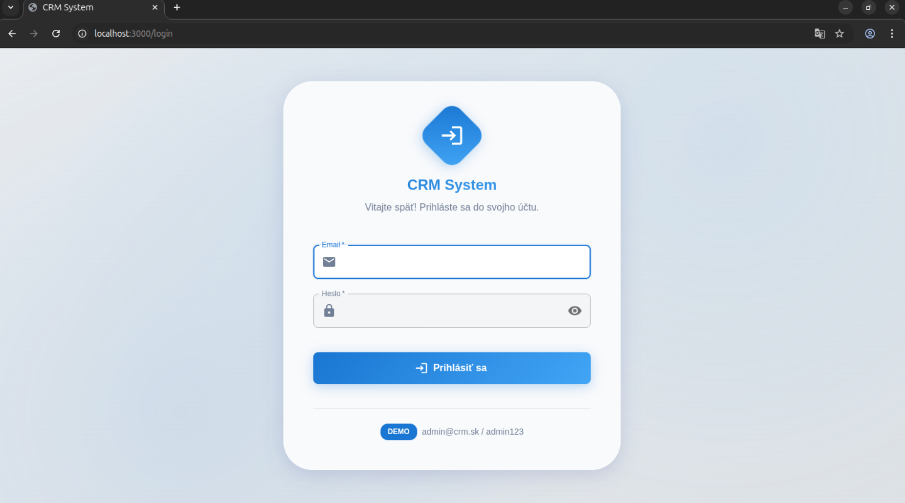
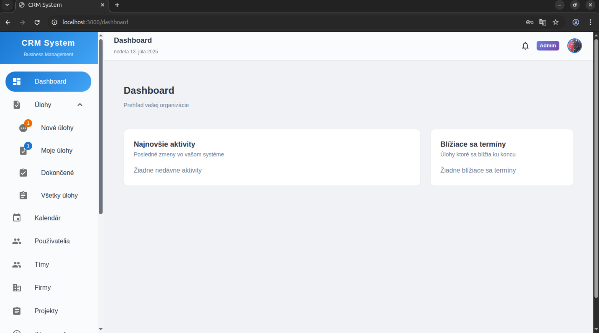
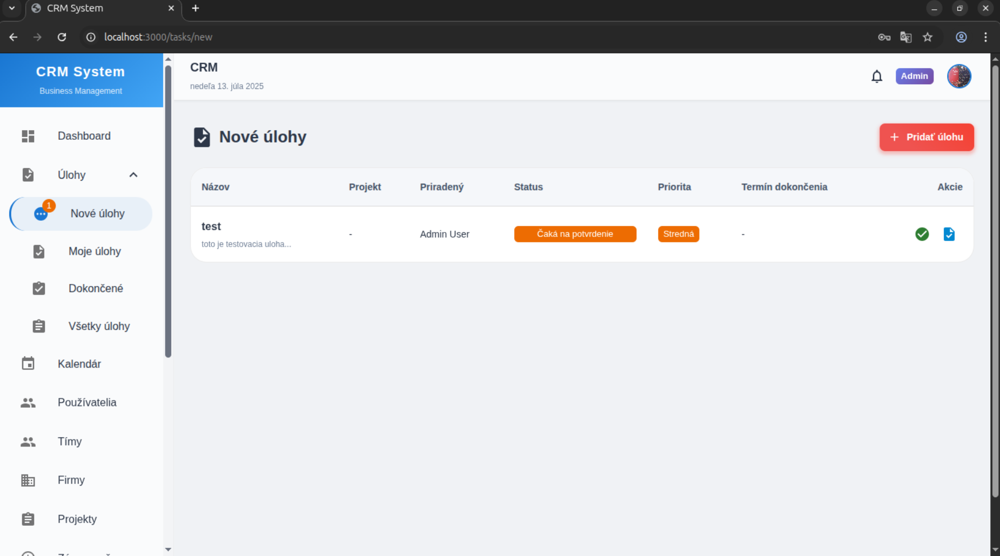
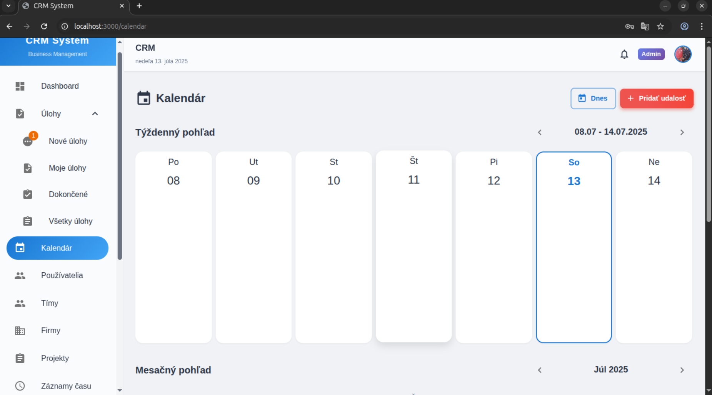

# 📋 CRM System - Moderný CRM Systém

## 🚀 Prehľad

**CRM System** je moderný, plne funkčný CRM (Customer Relationship Management) systém navrhnutý pre malé a stredné spoločnosti. Aplikácia je postavená na React frontendu s Node.js backendom a SQLite databázou, poskytujúca komplexné riešenie pre správu zákazníkov, projektov, úloh a tímov.

### ✨ Kľúčové vlastnosti

- 🎨 **Moderný modro-bielo-sivý dizajn** s jemnými animáciami
- 🇸🇰 **Slovenský jazyk** v celom rozhraní
- 👥 **Správa používateľov** s role-based prístupom
- 🏢 **Správa firiem a projektov**
- ✅ **Pokročilý task management** s potvrdením úloh
- ⏱️ **Time tracking** s automatickým a manuálnym zadávaním
- 💰 **Cenové ponuky** s komentármi a schvaľovaním
- 📊 **Reporting a dashboardy** s grafmi
- 💬 **Real-time chat** s emotikonami a prílohami
- 📧 **Email notifikácie** cez SendGrid
- 📁 **File sharing systém** s granulárnym zdieľaním
- 📅 **Kalendár** s týždenným a mesačným pohľadom
- 👥 **Tímy** pre skupinové projekty
- 🔐 **JWT autentifikácia** s bcrypt hashovaním

## 📸 Screenshots

### Dashboard


### Task Management


### Používatelia a správa tímov


### Chat a komunikácia


## 🏗️ Architektúra

### Backend (Node.js/Express)
- **Framework**: Express.js
- **Databáza**: SQLite (s možnosťou migrácie na MySQL)
- **Autentifikácia**: JWT tokens + bcrypt
- **File Upload**: Multer
- **Email**: SendGrid API
- **Real-time**: Socket.IO
- **Port**: 5555

### Frontend (React/Vite)
- **Framework**: React 18 + Vite
- **UI Library**: Material-UI (MUI) v5
- **Routing**: React Router v6
- **HTTP Client**: Axios
- **State Management**: Context API
- **Real-time**: Socket.IO Client
- **Emoji Picker**: emoji-mart
- **Image Viewer**: yet-another-react-lightbox
- **Charts**: Recharts
- **Date Picker**: MUI X Date Pickers + dayjs
- **Port**: 3000

### Databáza
- **Typ**: SQLite (lokálne súbory)
- **ORM**: Vanilla SQL s promisifikáciou
- **Migrácie**: Automatické pri štarte
- **Seed Data**: Predvolený admin účet

## 🛠️ Inštalácia a spustenie

### Predpoklady
```bash
Node.js >= 18.0.0
npm >= 8.0.0
```

### 1. Klonovanie repozitára
```bash
git clone https://git.gbls.sk/martin/inboxcrm.git
cd crm-system
```

### 2. Inštalácia závislostí
```bash
# Inštaluje závislosti pre frontend aj backend
npm run install-all
```

### 3. Backend konfigurácia
Vytvorte `.env` súbor v `server/` adresári:
```env
JWT_SECRET=crm_jwt_secret_key_2024
PORT=5555
NODE_ENV=development
CRM_BASE_URL=http://localhost:3000
```

### 4. Spustenie aplikácie
```bash
# Spustí frontend aj backend súčasne
npm run dev

# Alebo spustiť samostatne:
npm run server  # Backend na http://localhost:5555
npm run client  # Frontend na http://localhost:3000
```

Aplikácia bude dostupná na: http://localhost:3000

### 🔑 Predvolené prihlásenie
- **Email**: admin@crm.sk
- **Heslo**: admin123

## 📋 Funkcie systému

### 👤 Správa používateľov
- **Vytvorenie používateľov**: Iba admin môže registrovať nových používateľov
- **Role systém**: Admin / Zamestnanec
- **Oprávnenia**: Granulárne oprávnenia pre každú funkciu
- **Aktivácia/deaktivácia**: Používateľov možno dočasne deaktivovať
- **Hodinové sadzby**: Pre automatické výpočty v timesheetoch

### 🏢 Správa firiem a projektov
- **Firemné profily**: Kompletné informácie o klientoch
- **Projekty**: Priradenie k firmám a zamestnancom
- **Rozpočty**: Sledovanie projektových rozpočtov
- **Statusy**: Aktívne/ukončené projekty

### ✅ Task Management
- **Vytvorenie úloh**: S popisom, prioritou a termínom
- **Priradenie**: K projektom a zamestnancom
- **Statusy**: Pending, In Progress, Completed
- **Komentáre**: Komunikácia v rámci úloh
- **Prílohy**: Upload súborov k úlohám
- **Filtrovanie**: Podľa statusu, používateľa, projektu

### ⏱️ Time Tracking
- **Automatické**: Play/Stop button pre real-time tracking
- **Manuálne**: Zadanie času dodatočne
- **Projektové**: Priradenie času k projektom a úlohám
- **Reporty**: Detailné prehľady odpracovaného času
- **Výpočty**: Automatické náklady podľa hodinových sadzieb

### 💰 Cenové ponuky
- **Tvorba ponúk**: Pre firmy a projekty
- **Review systém**: Komentáre a schvaľovanie
- **Statusy**: Draft, Sent, Approved, Rejected
- **Export**: PDF generovanie (pripravené)

### 📊 Reporting a Dashboard
- **Dashboard**: Prehľad aktivít a termínov
- **Time Reports**: Detailné analýzy času
- **Project Progress**: Pokrok projektov
- **Employee Productivity**: Produktivita zamestnancov
- **Financial Overview**: Finančné prehľady
- **Filtrovanie**: Podľa dátumu, zamestnanca, projektu

### 💬 Real-time Chat
- **Priame správy**: Medzi zamestnancami
- **Online status**: Indikátor prítomnosti
- **WebSocket**: Okamžité doručenie správ
- **História**: Uložené konverzácie
- **Emotikony**: Podpora emoji výberu
- **Prílohy**: Zdieľanie súborov v chate
- **Lightbox**: Zobrazenie obrázkov na celú obrazovku

### 📧 Email Notifikácie
- **SendGrid integrácia**: Profesionálne email doručovanie
- **Web konfigurácia**: Všetky nastavenia cez UI
- **Typy notifikácií**:
  - Priradenie úloh
  - Komentáre k úlohám  
  - Pripomienky termínov
- **Templates**: Pekne formátované slovenské emaily
- **Test funkcia**: Overenie nastavení

### 📁 File Management
- **Upload súborov**: Drag & drop interface
- **Typy zdieľania**:
  - 🔒 **Súkromné**: Iba vlastník
  - 👤 **Používateľ**: Konkrétni ľudia
  - 🏢 **Projekt**: Všetci v projekte
  - 👥 **Tím**: Všetci zamestnanci
  - 🌐 **Verejné**: Všetci
- **Podporované formáty**: Obrázky, dokumenty, videá (max 50MB)
- **Activity tracking**: Log stiahnutí a zobrazení
- **Organizácia**: Hierarchické priečinky (pripravené)

### 📅 Kalendár
- **Týždenný pohľad**: Prehľad udalostí po dňoch
- **Mesačný pohľad**: Kalendárová mriežka
- **Synchronizácia**: Prepojené týždenné a mesačné zobrazenie
- **Slovenská lokalizácia**: Dni a mesiace v slovenčine
- **Zobrazenie autora**: Kto pridal úlohu
- **Farebné kódovanie**: Podľa priority úloh

### 👥 Tímy
- **Správa tímov**: Vytváranie a úprava tímov
- **Členovia**: Priradenie používateľov do tímov
- **Tímové projekty**: Projekty priradené celému tímu
- **Tímové úlohy**: Spolupráca na úlohách

### ⚙️ Nastavenia
- **Email konfigurácia**: SendGrid API nastavenia
- **Firemné údaje**: Názov, adresa, kontakty
- **Systémové**: Mena, dátum, časové pásmo, pripomienky

## 🔒 Bezpečnosť

- **JWT autentifikácia** s expirovaním tokenov
- **Bcrypt hashing** pre heslá (salt rounds: 10)
- **Role-based access control** (RBAC)
- **Input validácia** na frontend aj backend
- **SQL injection prevention** cez prepared statements
- **File upload security** s type checking
- **CORS konfigurácia**

## 🗄️ Databázová schéma

### Hlavné tabuľky
- `users` - Používatelia s rolami a oprávneniami
- `companies` - Firemné profily klientov
- `projects` - Projekty priradené k firmám
- `tasks` - Úlohy s komentármi a prílohami
- `timesheets` - Záznamy odpracovaného času
- `quotes` - Cenové ponuky s review systémom
- `chat_messages` - Real-time správy s prílohami
- `files` - Nahrané súbory s oprávneniami
- `teams` - Tímy pre skupinovú prácu
- `team_members` - Členovia tímov
- `calendar_events` - Udalosti v kalendári
- `notifications` - Systémové notifikácie
- `settings` - Systémové nastavenia

### Bezpečnostné tabuľky
- `permissions` - Definície oprávnení
- `user_permissions` - Priradenie oprávnení k používateľom
- `file_permissions` - Oprávnenia k súborom
- `file_activity` - Log aktivít so súbormi

## 🚀 API Endpoints

### Autentifikácia
```
POST /api/auth/login - Prihlásenie
GET  /api/auth/me - Informácie o používateľovi
POST /api/auth/change-password - Zmena hesla
```

### Používatelia
```
GET    /api/users - Zoznam používateľov
POST   /api/users - Vytvorenie používateľa
PUT    /api/users/:id - Úprava používateľa
DELETE /api/users/:id - Vymazanie používateľa
```

### Projekty a úlohy
```
GET  /api/projects - Zoznam projektov
POST /api/projects - Vytvorenie projektu
GET  /api/tasks - Zoznam úloh
POST /api/tasks - Vytvorenie úlohy
PUT  /api/tasks/:id - Úprava úlohy
```

### Súbory
```
POST /api/files/upload - Upload súboru
GET  /api/files - Zoznam súborov
GET  /api/files/:id/download - Stiahnutie súboru
PUT  /api/files/:id/permissions - Úprava oprávnení
```

### Chat a notifikácie
```
GET  /api/chat/messages - História správ
POST /api/chat/messages - Odoslanie správy
POST /api/settings/test-email - Test email
```

## 🎨 UI/UX Funkcie

### Moderný dizajn
- Svetlý modro-bielo-sivý theme
- Jemné tiene a gradientové akcenty
- Animácie pri hover a interakciách
- Zaoblené rohy (12px border radius)
- Material Design komponenty
- Glassmorphism efekty na login stránke

### Responzívnosť
- Mobile-first prístup
- Adaptívne tabuľky a formuláre
- Touch-friendly interface
- Breakpoints pre všetky zariadenia

### Používateľský zážitok
- Drag & drop file upload
- Real-time updates
- Progress indikátory
- Toast notifikácie
- Loading states
- Error handling

## 📈 Výkonnosť

### Optimalizácie
- Lazy loading komponentov
- Optimalizované database queries
- Compression pre súbory
- Caching pre statické assety
- Minimálne bundle sizes

### Limity
- Max file size: 50MB
- Concurrent connections: Unlimited
- Database size: Až po disk space
- Session timeout: 7 dní

## 🔧 Rozšíriteľnosť

### Pripravené rozšírenia
- **MySQL migrácia**: Zmena z SQLite
- **Multi-tenancy**: Viacero organizácií
- **API versioning**: RESTful API rozšírenia
- **Folder system**: Hierarchické priečinky
- **Advanced reports**: PDF export
- **Mobile app**: React Native verzia

### Integrácie
- **CRM systémy**: Salesforce, HubSpot
- **Účtovníctvo**: Fakturácia APIs
- **Cloud storage**: AWS S3, Google Drive
- **SSO**: LDAP, OAuth providers

## 🐛 Troubleshooting

### Časté problémy

**Port už používaný**
```bash
lsof -ti:5555 | xargs kill -9  # Server
lsof -ti:3000 | xargs kill -9  # Client
```

**Databáza problémy**
```bash
rm server/database/crm.db  # Vymaže databázu (stratia sa dáta!)
npm run server             # Znovu vytvorí s default dátami
```

**Email nefunguje**
- Skontrolujte SendGrid API key v Nastaveniach
- Overte domain authentication v SendGrid
- Použite "Testovať email" funkciu

**Súbory sa nenačítajú**
```bash
mkdir -p server/uploads/files  # Vytvorí potrebné priečinky
chmod 755 server/uploads       # Nastaví oprávnenia
```

---

## 🏁 Quick Start Checklist

1. ✅ Nainštalujte Node.js 18+
2. ✅ Klonujte repo: `git clone https://git.gbls.sk/martin/inboxcrm.git`
3. ✅ Prejdite do priečinka: `cd crm-system`
4. ✅ Nainštalujte závislosti: `npm run install-all`
5. ✅ Vytvorte `.env` súbor v server/ priečinku
6. ✅ Spustite aplikáciu: `npm run dev`
7. ✅ Otvorte http://localhost:3000
8. ✅ Prihláste sa: admin@crm.sk / admin123
9. ✅ Nastavte SendGrid v Nastaveniach (voliteľné)
10. ✅ Vytvorte prvých používateľov, firmy a projekty
11. ✅ Začnite používať váš nový CRM! 🎉

**CRM System je pripravený na produktívne nasadenie s možnosťou ľahkého škálovania a prispôsobenia potrebám vašej spoločnosti.**